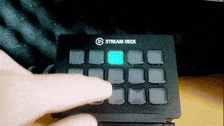
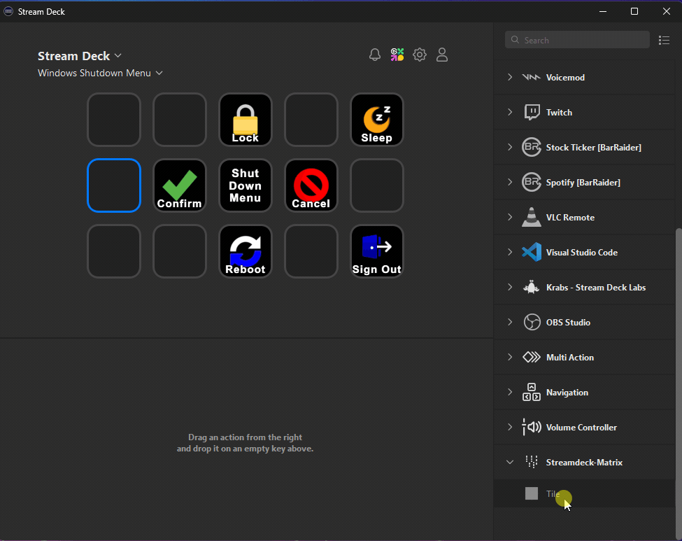

<h1 style="font-size: 32px;"> Streamdeck Tile Rain Matrix Plugin</h1>

A Streamdeck plugin for a matrix code rain inspired animation with a little mini game. Tap the green tile before they reach the ground to count up a highscore.

  

## Features

- [x] 🗽 Freely arrangeable tiles
- [x] 🎨 Configurable tile color
- [x] ⛷️ Configurable animation
- [x] 🎮️ Little counter clicker game

## How to use

Add a tile from the menu using drag & drop and the animation starts. It does not matter whether the field is completely covered with tiles. There can also be cells from other plugins between the matrix tiles.

_For example, between a shutdown menu:_

  

## Settings

<table>
  <tr><th>Name</th><th>Description</th></tr>
  <tr><td>Color</td><td>The color of the tiles</td></tr>
  <tr><td>Speed</td><td>The animation speed. Controls how quickly the tiles move from top to bottom and new cells are spawned</td></tr>
  <tr><td>Spawn Rate</td><td>The probability that a new rain drowp is spawned per animation step</td></tr>
</table>
